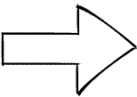
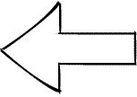

# Mesto

## **Описание проекта**

Учебный проект Yandex Практикум - одностраничный сайт с интерактивной страницей, где можно добавлять и удалять свои
фотографии,
ставить лайки и редактировать информацию о себе.

## **Стек**

* BEM Nested
* Flexbox
* Grid-layout
* Адаптивная верстка под размеры экранов 1280px, 1024px, 768px, 320px
* UI Kit
* Валидация всех форм
* Сборка Webpack
* API

## **Ссылка на сайт**

|  | https://nataliorigin.github.io/mesto |  |
|:---------------------------------------------------:|:------------------------------------:|:-----------------------------------------------------------------:|

## **Версия языка**

html5, CSS 3.0, ECMAScript 2018, Webpack 8.19.2

## **Будет реализовано в будущем**

* Бэкенд сайта

